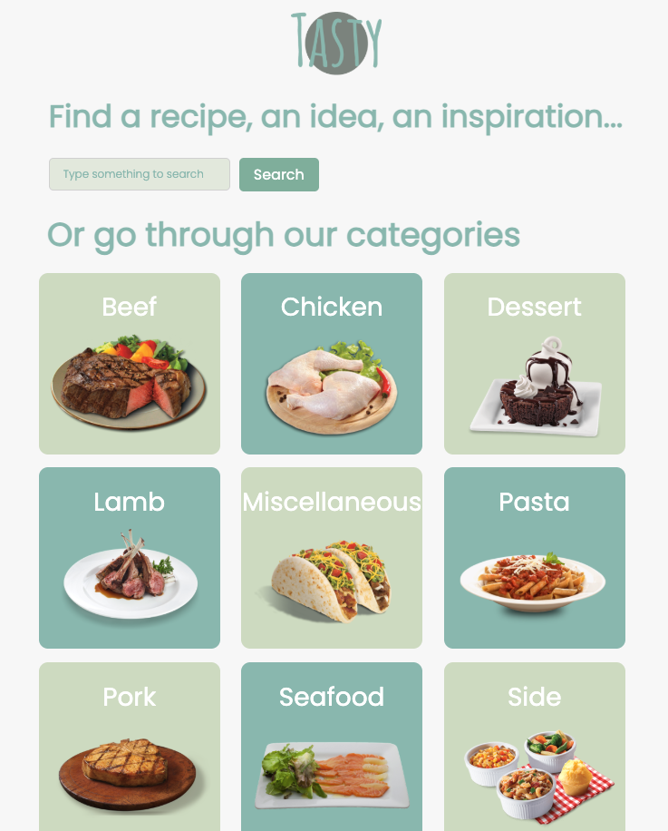
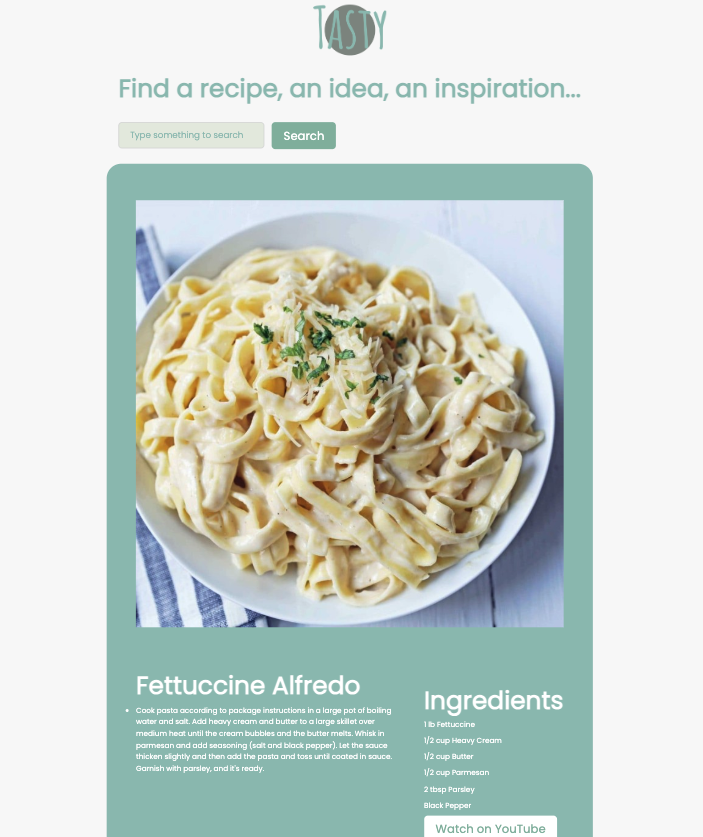

# React Project Tasty 🍝

## Intro

**Tasty** is an online platform for cooking enthusiasts that offers a wide range of delicious recipes. Here, you will find not only tried-and-tested recipes but also fresh ideas and inspiration to create a spectacular culinary experience at home. Whether you are looking for new dishes or simply want to have fun cooking, Tasty is the perfect place to fulfill your culinary ambitions.

## Preview




### Or check it out on Netlify[Tasty 🍲](https://sptastyapp.netlify.app/)

## Features

- Search function to find specific recipes or filter by various categories
- Dropdown suggestions in the search bar
- Category cards redirect to recipe suggestions pages
- Detailed recipe views with all the information needed to start cooking immediately
- Random category on the home page that surprises users with a recipe suggestion

## Technology Stack

- **Vite**
- **React**
- **TypeScript**
- **HTML**
- **CSS**
- **React Router DOM**

## API and Design

- Uses data from an API
- Developed according to a given Figma design

## Team

- **[André](https://github.com/cadeteandre)**
- **[Minyeong](https://github.com/manonsfoto)**
- **[Sharon](https://github.com/sharonVko)**

## Getting Started

To get started with the project, clone the repository and install the dependencies:

```bash
git clone git@github.com:cadeteandre/react-project-tasty.git
cd tasty
npm install
npm run dev
```
